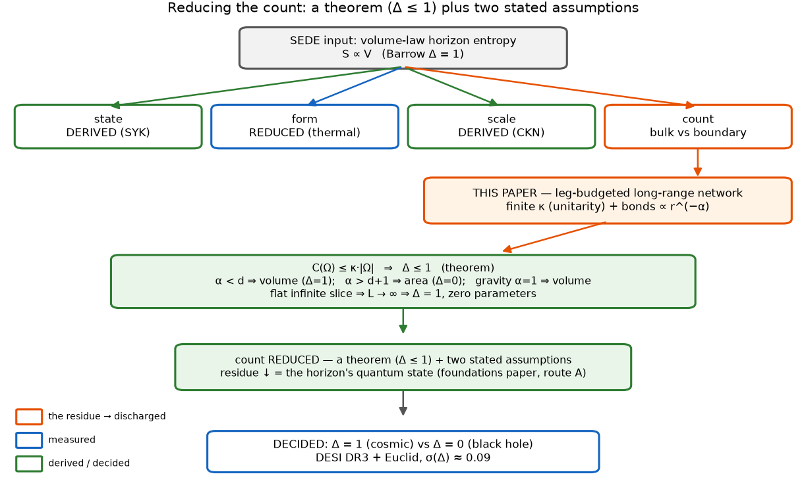
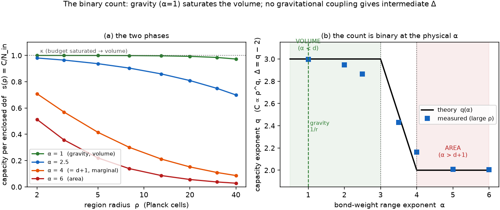
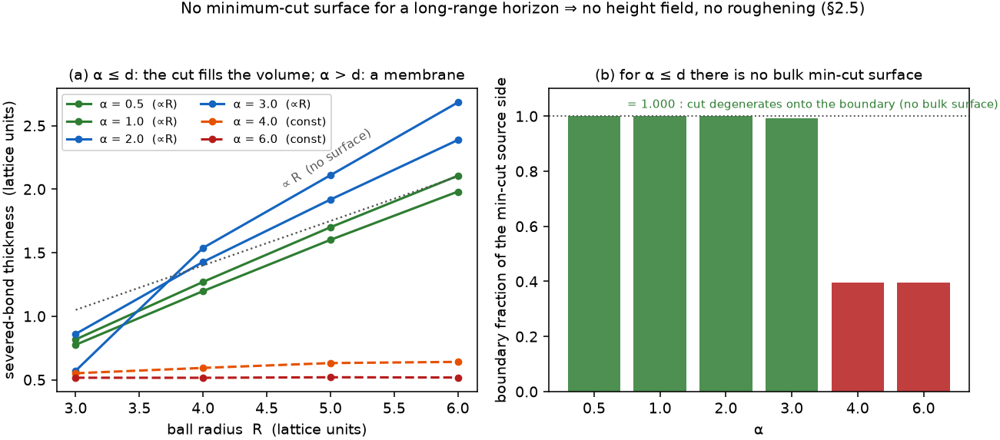
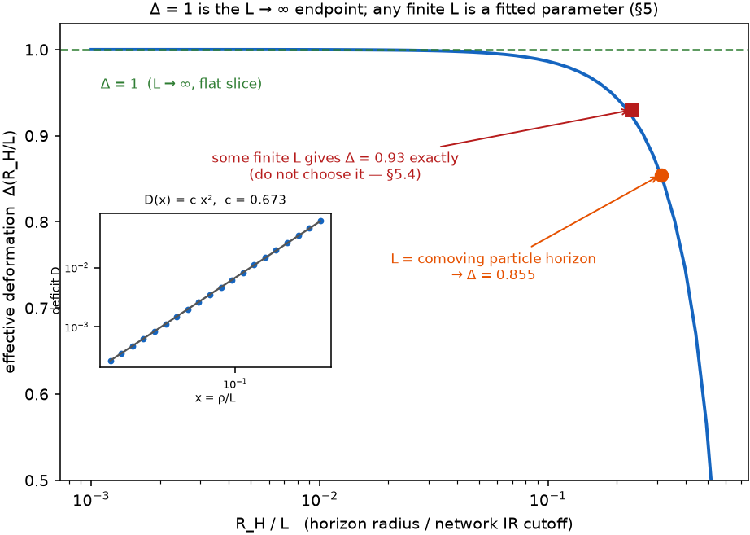

# A capacity theorem for long-range entanglement networks: the area–volume dichotomy and a bound on Barrow entropy

*(**This paper is self-contained.** The results of §2 — the capacity theorem C(Ω) ≤ κ|Ω| and hence
Δ ≤ 1, the area/volume dichotomy, the α = d crossover with its finite-size bound, and the α < d
absence of a minimum-cut surface — are statements about the network model of §2.1 alone. They are
state-independent (§6.1) and take no input from any other work. Readers interested only in the
network theorems need read no further than §4.*

*The paper is also a companion to the cosmology paper [@Pandev:2026cosmology] and the foundations
paper [@Pandev:2026foundations], which supply the cosmological motivation for asking the question
and the state half of its interpretation; neither is used to obtain the theorem, and the
cosmological results of both stand independently of the reduction developed here. Both companion
manuscripts are available from the author on request. All quantitative claims are reproduced by the
accompanying code, each with validation assertions.)*

---

## Abstract

We model the degrees of freedom of a gravitational horizon as a network of Planck-density sites, each
with a bounded total entanglement weight κ — a finite local Hilbert-space dimension — and bond weights
decaying with separation as w(r) ∝ r^(−α). Three results follow, each a theorem about this model
alone. First, a capacity theorem: the bond-cut capacity of any region Ω obeys C(Ω) ≤ κ|Ω|, so the
Barrow entropy deformation satisfies **Δ ≤ 1** identically; no fractal-horizon geometry is needed to
bound it, and for long-range couplings (α < d) none is available, since the minimum cut is not a
surface. Second, an area–volume dichotomy: the capacity is the enclosed *volume* (Δ = 1) for every
range α < d and the boundary *area* (Δ = 0) for α > d + 1, with the crossover at α = d exactly, and
the volume basin is derived with an explicit finite-size error bound, uniform in position; gravity's
Newtonian reach (α = 1) lies deep in the volume phase, and no gravitational coupling produces an
intermediate range, so a measured intermediate Δ falsifies the picture rather than selecting a
parameter — DESI DR3 and Euclid decide Δ = 1 versus Δ = 0 at a forecast σ(Δ) ≈ 0.09. Third, Δ = 1
exactly is the infrared-cutoff endpoint L → ∞. We state the limits explicitly: attaining Δ = 1
requires, beyond the α < d geometry, a cut-saturating horizon *state*, which we identify as the
tracial state of the site algebra, and whether a physical horizon is driven to it is left open; the
L → ∞ endpoint is a stated choice, not a derivation; what the network counts is a structural capacity,
not manifestly the generalized entropy; and the volume identification is the non-default,
empirically-bet-on branch. This shortens — it does not eliminate — the assumption list behind the
volume-law postulate of Structural Entropy Dark Energy. The results of §2 are self-contained: the
capacity theorem, the dichotomy and the crossover are statements about the network model of §2.1
alone, are state-independent, and take no input from the companion papers cited here, which supply
only the cosmological motivation for the question and the state half of its interpretation.

**Keywords —** holographic dark energy; horizon thermodynamics; entanglement entropy; de Sitter
holography; Barrow entropy; long-range systems; apparent horizon; dark energy.

---

## 1. Introduction

How much entropy can a region of a gravitational horizon carry, and does that count scale with the
enclosed *volume* or with the bounding *area*? We answer this inside a concrete model. The horizon
degrees of freedom are a network with a finite per-site *leg budget* κ — equivalently, a finite local
Hilbert-space dimension — and bond weights that decay as a power, w(r) ∝ r^{−α}. From this single
premise three results follow, each a statement about the network alone: a capacity theorem bounding
the Barrow deformation by Δ ≤ 1, an area–volume dichotomy with an exact crossover at α = d that places
gravity's 1/r reach deep in the volume phase, and the identification of Δ = 1 as the infrared-cutoff
endpoint L → ∞. The network cut-scaling that underlies the dichotomy is a question in long-range
percolation and small-world graph theory; what is new here is reading a *horizon* entropy count off it.

The question is not idle, and the motivation for asking it is cosmological. Structural Entropy Dark
Energy (SEDE) reproduces the cosmological data with no fitted dark-sector
parameter, at the cost of a single foundational input: the cosmic apparent horizon carries
*volume-law* entropy, S ∝ V (Barrow deformation Δ = 1), rather than the Bekenstein–Hawking area law.
The cosmology paper [@Pandev:2026cosmology] fixes the background from this input and confronts it with the data; the foundations paper [@Pandev:2026foundations] asks how much of
the input is irreducible, decomposing it into *state* (the horizon degrees of freedom are maximally
entangled), *form* (a thermalised state has volume-law entanglement), *scale* (the Cohen–Kaplan–Nelson
bound fixes ρ_DE ∼ ρ_crit), and *count* (whether the entropy counts the enclosed *bulk* degrees of
freedom or the *boundary* ones). The first three reduce to established physics; the count — bulk versus
boundary — is the residue the foundations paper names as irreducible, a de Sitter holography question with no
shortcut past the observer-algebra trace calibration. This paper reduces that count to a shorter list
of stated assumptions; it does not fully discharge it.

The three results in detail (Figure 1), each machine-checked (§Reproducibility):

1. **Δ ≤ 1 is a theorem** (§2.2). The bond-cut capacity of any region obeys C(Ω) ≤ κ·|Ω| identically —
 the entropy a region can carry cannot exceed its degree-of-freedom count. No fractal ceiling and no
 premise that the horizon is a space-filling surface are needed; Δ > 1 is impossible, and a
 high-significance Δ > 1 would falsify the framework with no parameter to absorb it.
2. **The count is binary, and gravity is on the volume side** (§2.3–§2.4). The capacity exponent is the
 enclosed *volume* (Δ = 1) for every coupling of range α < d and the *area* (Δ = 0) for α > d+1, with
 the crossover at α = d exactly — the same threshold that separates additive from non-additive
 long-range statistical mechanics and at which the entanglement area-law theorems [@Eisert:2008ur] lose
 their hypothesis (§3). The α-controlled volume→(fractal)→area crossover itself is established in the
 long-range-entanglement literature [@Vitagliano:2010db; @Solfanelli:2023vav; @Chakraborty:2023mrw] and, for the network cut-scaling itself, in long-range percolation and small-world graph theory [@BenjaminiBerger:2001; @Biskup:2004; @Kleinberg:2000]; our
 contribution is to read a Barrow index Δ = q − 2 off it for a *horizon* count, not the crossover. Gravity's 1/r reach sits at α = 1, deep in the volume basin (§4); the equilibrium, area-law
 frameworks are its local limit. Whatever selects Δ = 1 must therefore be a *saturation* argument.
3. **Δ = 1 as the infinite-cutoff endpoint** (§5). The only source of a deficit below the volume law is
 a finite infrared cutoff L on the network; nothing *internal* to SEDE fixes L, so Δ is a monotone
 function of it, and Δ = 1 is the L → ∞ endpoint suggested by the flat, infinite spatial slice. This is
 a *choice of cutoff* — the identification of the cosmological spatial slice with the
 entanglement-network infrared cutoff — not a derivation (§5.3–§5.4); Δ = 1 remains the theory's one
 postulate, restated at the endpoint.

The residue that survives is *strictly weaker* than the postulate it replaces (§7): a finite leg budget
(unitarity), a bond weight decaying slower than r^{−d} (an inequality, not a functional form), the
infinite-cutoff identification L → ∞ (a stated choice, §5.3), and the
maximally-scrambled state of route A of the foundations paper (untouched). What is bought is that the open content of
SEDE now sits in two named places — the horizon's quantum *state* and the L → ∞ endpoint reading of its
*count* — and, for the one horizon
we have, is decided by a scheduled measurement: Δ = 1 for the driven cosmic horizon and Δ = 0 for
equilibrium (black-hole) horizons, separated by DESI DR3 + Euclid at a forecast σ(Δ) ≈ 0.09. We are explicit about
what we do not claim: the network is a *model* of the horizon degrees of freedom, not a derivation of
them from a fundamental theory, and the bond cut is a *capacity*, an upper bound whose attainment is the
state question (§6). What the paper delivers is the counting residue reduced to a theorem (the ceiling)
plus two honestly-stated assumptions (the network model with its range inequality, and the L → ∞
endpoint choice), and a geometry — the count is not a Hausdorff dimension — sharp enough to
be falsified.

**Figure 1.** The reduction. SEDE's one input — volume-law horizon entropy — decomposes into *state*,
*form*, *scale*, and *count* (the foundations paper); the first three reduce to established physics, and the *count*
is the irreducible residue. Modelling the horizon degrees of freedom as a leg-budgeted long-range
network reduces it: C(Ω) ≤ κ·|Ω| makes Δ ≤ 1 a theorem (§2.2), α < d puts gravity on the volume
branch (§2.3–§4), and Δ = 1 is the L → ∞ endpoint of the flat infinite slice — a cutoff choice, not a
derivation (§5). What survives is the horizon's quantum
*state* (route A of the foundations paper) and that endpoint identification, decided — with the
black-hole Δ = 0 — by DESI DR3 + Euclid.

---

## 2. The count from a leg-budgeted long-range network

### 2.1 Setup

Let the horizon degrees of freedom be sites of a network filling a ball of radius L at
number density n = ℓ_P^(−d), d = 3, with symmetric bond weights

$$w_{ij} \propto r_{ij}^{-\alpha}, \qquad \sum_j w_{ij} = \kappa \quad\text{for every } i. \tag{2.1}$$

The budget in (2.1) is not an idealisation. In a tensor-network representation the leg
weight attached to a site is ln(local Hilbert-space dimension); unitarity bounds it. Given
the shape r^(−α), the budget is imposed by the unique symmetric scaling
w = diag(d) W diag(d) with prescribed row sums — the symmetric Sinkhorn problem, which
for positive symmetric W has a unique positive solution. All numbers below are computed at
Sinkhorn residual < 10^(−9).

We take as the count the **bond-cut capacity** of a region Ω,

$$C(\Omega) = \sum_{i\in\Omega,\, j\notin\Omega} w_{ij}, \tag{2.2}$$

the standard upper bound on the entanglement entropy of Ω with its complement. C is a
capacity, not an entropy: whether it is attained depends on the state (§6). Everything in
this section concerns C.

### 2.2 The capacity theorem

From (2.1) and (2.2), for any region Ω,

$$C(\Omega) \le \sum_{i\in\Omega} \sum_j w_{ij} = \kappa\,|\Omega|. \tag{2.3}$$

The entropy of a region cannot exceed its degree-of-freedom count. Writing S ∝ R^(2+Δ)
in the Barrow parametrisation S = (A/A₀)^(1+Δ/2), (2.3) gives

$$\Delta \le 1. \tag{2.4}$$

This is the ceiling of the cosmology paper (§8.1) [@Pandev:2026cosmology] — obtained here without reference to the Hausdorff
dimension of the horizon, and without the premise that the horizon is a fractal 2-surface.
Finite local dimension is the whole content. The theorem is model-conditional: it is a statement about
the leg-budgeted network of §2.1 — with the α = d crossover of §2.3 now carrying an explicit
finite-size error bound (Proposition 2.1) rather than an unproven limit interchange — not about an
arbitrary horizon. Two consequences are worth stating plainly.
First, Δ > 1 is impossible in this framework, so a high-significance measurement of Δ > 1
falsifies it with no parameter available to absorb the result. Second, whatever selects
Δ = 1 must be a *saturation* argument, since (2.3) is the only bound in play.

### 2.3 The crossover is at α = d

Consider a site at radius s inside a sphere of radius ρ ≪ L. The bond mass it places at
separations in [u, u+du] scales as u^(d−1−α) du. Its **outward fraction** — the share of
its budget spent on bonds crossing ρ — is therefore governed by

$$\int^L u^{d-1-\alpha}\,du \quad\text{versus}\quad \int^\rho u^{d-1-\alpha}\,du. \tag{2.5}$$

For α < d the integral is dominated by its upper limit: the bond mass sits at the largest
separations, the outward fraction tends to unity for every interior site, and

$$C(\rho) \to \kappa\, n\, V(\rho) \qquad \text{(volume law, budget saturated).} \tag{2.6}$$

As stated, (2.6) is a limiting statement, and the limits do not commute: at fixed ambient size L the
outward fraction *decreases* with ρ and must vanish as ρ → L, so "dominated by the upper limit"
cannot be read as ρ → ∞ at fixed L. The following proposition replaces the limit by an explicit
finite-size error, uniform in the site position, and is what the volume law rests on here.

> **Proposition 2.1 (uniform outward-fraction bound).** Let sites of density n = ℓ^{−d} fill a ball
> of radius L, let α < d, and let f_out(x) be the fraction of the budget of a site at x, |x| ≤ ρ,
> carried by bonds crossing the sphere of radius ρ. Then for every such x,
> $$f_{\rm out}(x) \;\ge\; 1 - K(d,\alpha)\,(\rho/L)^{\,d-\alpha}, \qquad
> K(d,\alpha) = \frac{S_{d-1}\,2^{\,d-\alpha}/(d-\alpha)}{c_d\,(1-2^{-d})\,2^{-\alpha}},$$
> with S_{d−1} the unit-sphere surface and c_d the unit-ball volume. Consequently
> $$\kappa\,n\,V(\rho)\left[1 - K(d,\alpha)(\rho/L)^{d-\alpha}\right] \;\le\; C(\rho) \;\le\; \kappa\,n\,V(\rho). \tag{2.6a}$$
>
> *Proof.* Every point of the interior ball lies within distance 2ρ of x, so the inward mass is at
> most n S_{d−1}∫_0^{2ρ} u^{d−1−α}du = n S_{d−1}(2ρ)^{d−α}/(d−α), the integral converging at u = 0
> precisely because α < d. Every point of the outer shell L/2 < |y| < L lies within distance 2L of
> x, so the outward mass is at least n c_d(1−2^{−d})L^d·(2L)^{−α}. Since f_out = 1/(1 + in/out) ≥
> 1 − in/out, the ratio of these two gives the stated K. The upper bound in (2.6a) is the capacity
> theorem of §2.2. ∎

Three things follow. First, the volume law is a statement at **finite** (ℓ, ρ, L) with a controlled
error, so no interchange of ρ → ∞ with the continuum limit is invoked. Second, the same condition
α < d that makes the short-distance integral converge is what makes the discrete-to-continuum
replacement safe: the near-field discrepancy between the lattice sum and the integral is relatively
O((ℓ/ρ)^{d−α}), vanishing in the same regime. Third, the error term makes explicit *why* Δ = 1 exactly
is the L → ∞ endpoint of §5 rather than a finite-size result — the deficit is governed by ρ/L, not by
ρ alone.

The bound is rigorous but its constant is not sharp. Numerically (`src/outward_fraction_bound.py`,
d = 3, L = 200, exact angular average), the measured capacity deficit follows the predicted power
(ρ/L)^{d−α} with a constant of order unity: at gravity's α = 1 the fitted deficit exponent is 2.03
against the predicted d − α = 2, with K_measured ≈ 0.79 stable across ρ ∈ [5, 40], while the proved
constant is K = 13.7 — valid, and loose by a factor ≈ 17. The fit degrades as α → d (at α = 2.5 the
fitted exponent is 0.79 against a predicted 0.5), which is expected: there the deficit is no longer
small and the leading term does not yet control the behaviour. For gravity's range the asymptotics
are firmly in their regime.

For α > d the integral converges at small u: only a surface layer of thickness O(ℓ_P)
contributes, and C(ρ) ∝ A(ρ) (area law). The crossover is at α = d exactly — the same
threshold that separates additive from non-additive long-range systems
(Campa–Dauxois–Ruffo [@Campa:2009jxa]), and the same one at which the hypothesis of the entanglement
area-law theorems (Hastings [@Hastings:2007iok]; Brandão–Horodecki [@Brandao:2013fpa]) fails.

**Numerical confirmation (Figure 2).** Spherical reduction with the exact angular average of
|x−y|^(−α), ambient L = 200, κ = 1. The table gives s(ρ) ≡ C(ρ)/N_in, the capacity per
enclosed degree of freedom, and q from C ∝ ρ^q:

| α | ρ=2 | ρ=5 | ρ=10 | ρ=20 | ρ=40 | q |
|---|---|---|---|---|---|---|
| 1.0 | 0.9999 | 0.9996 | 0.9983 | 0.9933 | 0.9728 | **2.99** |
| 2.0 | 0.9969 | 0.9873 | 0.9707 | 0.9371 | 0.8690 | 2.96 |
| 2.5 | 0.9805 | 0.9375 | 0.8850 | 0.8089 | 0.6994 | 2.89 |
| 4.0 | 0.7088 | 0.4156 | 0.2569 | 0.1518 | 0.0863 | 2.30 |
| 6.0 | 0.5135 | 0.2206 | 0.1119 | 0.0562 | 0.0281 | **2.03** |

Table: Capacity per enclosed degree of freedom s(ρ) = C(ρ)/N_in and measured capacity exponent q (C ∝ ρ^q) versus bond range α, in the spherical reduction (L = 200, κ = 1).

At α = 6 the capacity per site halves exactly when ρ doubles: s ∝ 1/ρ, the area law, to
three figures. At α = 1 it sits at κ to four decimals: **every degree of freedom spends
essentially its entire budget outward.** The volume law is not imposed by a ceiling; it is
attained.

The α = 4 row warrants a word, because its q = 2.30 has not reached 2 and could be mistaken for a
failure to converge. It is not: α = 4 = d + 1 is the *marginal* area point,
where the capacity-carrying surface layer has a logarithmic tail, C(ρ) ∝ ρ²·ln ρ, so the
finite-ρ exponent is q(ρ) = 2 + O(1/ln ρ) — inflated above 2 but *decreasing*, not a stable
power. Pushing the ambient size out (L = 1500, ρ up to 180) settles it with a normalisation-free
diagnostic, C(ρ)/ρ²: at α = 4 it rises linearly in ln ρ (slope ≈ 2.9 > 0), the signature of the
marginal logarithm, whereas at α = 5 — just past the marginal point — it is flat to 6 % with
q = 2.01, the clean area law. No α produces a *stable* exponent between 2 and 3: the α = 4
elevation is a marginal logarithm on the area side, and it sharpens rather than softens the
binary dichotomy of §2.4. (For d < α < d + 1 the same analysis gives a genuine but still
non-volume q → 3 − (α − d); at α = 3.5, q climbs toward 2.5. The volume phase, q = 3, is reached
only for α < d.)

Identifying the saturated capacity with a constant entropy density,

$$s_0 = \kappa\, n = \kappa/\ell_P^3, \tag{2.7}$$

recovers eq. (2.2) of the cosmology paper [@Pandev:2026cosmology], s_grav = s₀, with the constant identified as legs per Planck
cell.

### 2.4 The dichotomy is binary — for a gravitational horizon

Equation (2.6) holds for **every** α < d, not merely α = 1: the volume phase is a basin,
not a knife-edge. The model therefore never requires the specific form w(r) = 1/r. It
requires only

$$w(r)\ \text{decays slower than}\ r^{-d}. \tag{2.8}$$

Any coupling of gravitational reach satisfies (2.8) with room to spare. We are careful about
what is and is not binary. The capacity exponent is q = 3 (volume) for *every* α < d and
q = 2 (area) for α > d+1; the intermediate window d < α < d+1 does interpolate,
q = 3 − (α − d), with α = d+1 the marginal area case (q → 2 with a logarithm) — the crossover
is a genuine continuum in α (§2.3), not a two-valued function. What is binary is the count
for a *gravitational* horizon: gravity is 1/r, so α = 1 ≪ d, sitting deep in the volume basin,
while the equilibrium/area frameworks are local (effectively α > d+1). An intermediate Δ would
require an intermediate-*range* horizon coupling, d < α < d+1, for which there is no physical
mechanism — gravity supplies no such exponent. **A measured intermediate Δ therefore falsifies
the gravitational-network picture — no coupling of gravitational reach produces it — rather than
selecting a tunable exponent.** In particular it closes the door on the Kardar–Parisi–Zhang branch
(Δ ≈ 0.61) once floated as a distinguishable alternative in the foundations paper: §2.5 shows there is no
roughening universality class to select in the first place.

**Figure 2.** The binary count (§2.3–2.4). *(a)* Capacity per enclosed degree of freedom
s(ρ) = C/N_in: at α = 1 (gravity) it saturates the leg budget κ (the volume law); at α = 6 it falls as
1/ρ (the area law). *(b)* The capacity exponent q (with Δ = q − 2) versus the bond-range α: q = 3
(volume) for every α < d and q = 2 (area) for α > d+1, interpolating only in the *unphysical* window
d < α < d+1 (the marginal α = d+1 = 4 point carries a logarithm, so its finite-ρ value sits just above
2). Gravity's 1/r reach (α = 1) lies deep in the volume basin; no gravitational coupling yields an
intermediate Δ.

### 2.5 For α < d there is no minimum-cut surface

The Ryu–Takayanagi prescription reads entanglement entropy off a *minimal cut surface*.
That object exists only when the bonds are local. We test this directly by maximum flow on
a lattice ball, with boundary legs of the upper cap tied to a source and the lower cap to a
sink at infinite capacity, so that every cut passes through the bulk. Two diagnostics,
neither of which depends on any normalisation:

**(i) Thickness of the severed-bond set, in lattice units** (weighted RMS of the midpoint
height of cut bonds):

| α | R=3 | R=4 | R=5 | R=6 |
|---|---|---|---|---|
| 0.5 | 0.78 | 1.20 | 1.60 | 1.98 |
| 1.0 | 0.82 | 1.27 | 1.70 | 2.11 |
| 2.0 | 0.86 | 1.43 | 1.92 | 2.39 |
| 3.0 | 0.57 | 1.54 | 2.11 | 2.68 |
| 4.0 | 0.55 | 0.59 | 0.63 | 0.64 |
| 6.0 | 0.516 | 0.516 | 0.520 | 0.518 |

Table: Thickness of the severed-bond set (weighted RMS midpoint height, lattice units) versus ball radius R for each bond range α, from the maximum-flow minimum cut on the lattice ball.

For α > d the thickness is R-independent — a sharp interface one lattice spacing thick,
and the cut is the equatorial disk (|S|/N → 0.447, a half-ball). For α ≤ d it grows ∝ R:
the severed bonds fill the volume (Figure 3).

**(ii) Where the cut lives.** For every α ≤ 3 and every R tested, the fraction of the
source side of the minimum cut consisting of boundary sites is **1.000, exactly**: the cut
degenerates onto the boundary shell. There is no bulk surface, because there is no
emergent bulk geometry. (The cut cost then scales as R^(5−α) — super-volume — which is
the signature of the *unbudgeted* network's illegitimacy: per-site leg weight
Σ_j r_ij^(−1) ~ R² diverges, and no finite local Hilbert space supports it. Imposing (2.1)
removes the pathology and returns (2.6).)

**Figure 3.** No minimum-cut surface for a long-range horizon (§2.5). *(a)* The thickness of the
severed-bond set grows ∝ R for α ≤ d (the cut fills the volume — there is no surface) and is
R-independent for α > d (a one-cell membrane). *(b)* The boundary fraction of the minimum cut's source
side is 1.000 for α ≤ d (the cut degenerates onto the boundary shell) and ≈ 0.40 for α > d (a genuine
bulk membrane). With no min-cut surface there is no height field, no roughness exponent, and no
roughening — so Δ is a count, not a Hausdorff dimension.

The consequence is structural. With no minimum-cut surface there is no height field, no
roughness exponent, and no roughening universality class. **Δ is a count, not a Hausdorff
dimension**, exactly as the cosmology paper (§8.5) maintains. This is also the foundations paper's
position: it reads the count as the bare bound Δ ≤ 1, which §2.2 here *derives* — so the fractal reading
Δ = d_H − 2 is unnecessary.[^1]

An independent confirmation from the classical side: in linearised GR the apparent-horizon
condition θ₊ = 0 is, in Newtonian gauge (where the constant-time slicing is shear-free, so
K_ij is pure trace), the constant-mean-curvature condition 𝓜 = 2H. It is the Euler–Lagrange
equation of A[h] − 2H·V[h], and since the area functional
A = $\bar{R}^2$∫dΩ[(1+h)² + ½|∇_S h|² + O(|∇_S h|⁴)] carries no cubic term, the constraint reads

$$\nabla_S^2 h + 2h + 2h^2 = 2\mathcal{S}, \qquad \mathcal{S} = \Phi + \Psi + \dot\Psi/H - H^{-1}\partial_R \Psi. \tag{2.9}$$

There is no (∇h)² term at second order, and — decisively — no ∂_t h at any order. The
operator ∇²_S + 2 is elliptic on the sphere; h_ℓm = 2𝒮_ℓm/(2 − ℓ(ℓ+1)) is slaved
instantaneously to the matter perturbations, and high multipoles are suppressed as 1/ℓ². The
classical apparent horizon does not roughen. It has no growth equation to roughen with. That the
apparent-horizon shape can be found this way — perturbatively, order by order, as a slaved constraint
within the canonical formalism — is independently established by Neuser and Thiemann, who compute it to
second order in gauge-invariant perturbation theory [@Neuser:2026unc].

This operator is not ours to invent: ∇²_S + 2 is the Andersson–Mars–Simon marginally-outer-trapped-surface
(MOTS) stability operator [@Andersson:2007fh] specialised to the FRW apparent horizon. On the round 2-sphere
(areal radius $\bar{R}$ = 1/H) the AMS operator L ψ = −∇²_S ψ + 2 s^A D_A ψ + (½R_S − |σ⁺|² − s_A s^A +
D_A s^A − 8π T_{ab}ℓ^a k^b)ψ collapses — spherical symmetry gives s_A = 0, the horizon is
shear-free (σ⁺ = 0), and for the within-slice shape variation it reduces to the classical
mean-curvature Jacobi operator −(∇²_S + |A|²) with |A|² = 2/$\bar{R}^2$, i.e. exactly −(1/$\bar{R}$)(∇²_S + 2). Its
spectrum is the published one, ℓ(ℓ+1) − 2, and the **ℓ = 1 kernel is the translation zero mode
every MOTS stability operator carries** — not a coincidence but the sphere's freedom to be
displaced. We reproduce this independently, by a second geometric route (surface-of-revolution
principal curvatures) matched to the spectrum, so the GR leg of this argument rests on a published
2008 theorem rather than on our own symbolic algebra (`src/ams_stability.py`).

*Slicing caveat.* The clean *elliptic* (∂_t-free) form is specific to the shear-free Newtonian
slice with flat spatial sections. The AMS matter term for FRW is 8π T_{ab}ℓ^a k^b = 3H² + Ḣ, so the
*null-direction* (marginally-outer-trapped-tube, i.e. time-evolution) variation carries an Ḣ that the
within-slice shape operator does not: the two differ by exactly the horizon's evolution term. It is
the within-slice shape equation — the one governing whether the horizon *roughens* — that is elliptic
and slaved; the ∂_t enters only the orthogonal question of how the horizon moves between slices.

[^1]: The ε-lag / roughening observable of the companion papers is superseded here: eq. (2.9) leaves the
classical apparent horizon with no growth equation to roughen with. The companion papers already reflect
this — the foundations paper reduces its membrane section to the exact coefficients and withdraws the
roughening layer, and the cosmology paper withdraws the corresponding predictions (its §6).

---

## 3. The premise: finite local dimension, and why α < d evades the area law

The two ingredients of §2 — a finite leg budget κ and a bond weight decaying slower than r^{−d} — are
not exotic; each is weaker than something already standard.

**Finite κ is unitarity.** In a tensor-network representation of the horizon state, the weight on a leg
attached to a site is the logarithm of the local bond dimension, ln χ, which a finite-dimensional local
Hilbert space bounds. The per-site budget Σ_j w_ij = κ of (2.1) is therefore the statement that each
horizon degree of freedom has a bounded amount of entanglement to distribute — a consequence of
unitarity, not an assumption about geometry. The bond cut C(Ω) is then the standard Ryu–Takayanagi /
minimum-cut upper bound on the entanglement entropy of Ω (§6.1). Everything in §2.2–§2.4 uses only this
budget and the *range* of the weights; it never uses the specific form 1/r.

**Why α < d is allowed — the area-law theorems and their hypothesis.** A natural objection is that
entanglement entropy "always" obeys an area law, so a volume-law horizon is forbidden. It is not: the
entanglement area-law *theorems* are theorems about *local* systems. In one dimension, gapped local
Hamiltonians have area-law (there, constant) ground-state entanglement [@Hastings:2007iok]; the
higher-dimensional results [@Brandao:2013fpa] likewise assume short-range interactions and a spectral
gap. Their load-bearing hypothesis is exactly locality — couplings that fall off fast enough that a
region's boundary dominates its entanglement — and that hypothesis fails precisely when the weights
decay slower than r^{−d}: the same α = d threshold at which our capacity crossover sits (§2.3) and at
which long-range statistical mechanics stops being additive [@Campa:2009jxa]. A volume-law entanglement
entropy is thus not a violation of anything; it is the generic expectation once the connectivity is
long-range. The premise (2.8) is the *negation* of the area-law theorems' hypothesis, and the horizon —
connected by gravity — is on the far side of it.

The reduction is therefore in the *strength* of what is assumed. The postulate replaced was "the horizon
entropy counts its volume." What remains is "the horizon degrees of freedom have finite local dimension
and a longer-than-marginal-range coupling," plus the state assumption of §6.1. The first is unitarity;
the second is an inequality gravity satisfies with two decades of margin (§4); only the third is a
genuine physical input, and it is the foundations paper's, not ours.

## 4. Gravity lands in the volume phase

Which side of the α = d crossover is the cosmic horizon on? The bond weights of (2.1) encode which
horizon degrees of freedom are entangled with which, and how strongly, as a function of separation. For
a horizon whose microscopic correlations are set by gravity, that reach is Newtonian, w(r) ∝ 1/r, so
α = 1 — well below d = 3, deep in the volume basin (2.6), with a margin of two full units in the
exponent. This is why the dichotomy of §2.4 is not delicate for the physical case: gravity does not sit
near the crossover, and no O(1) uncertainty in the effective coupling could carry it across two decades
to the area side.

That same long-rangedness is the object the foundations paper works with from the thermodynamic direction. There the
horizon degrees of freedom carry a cooperative coupling J = λ_max(W_grav) — the largest eigenvalue of
the very weight matrix W_ij ∝ r^{−α} of (2.1) — and α < d is exactly the regime in which that coupling
is *super-extensive* (λ_max ∝ N^{1−α/d}) and mean-field thermodynamics is exact [@Campa:2009jxa]. So the
network's "α < d ⇒ volume" of the present paper (the *count*) and the foundations paper's "non-additive cooperativity
⇒ a bistable area↔volume free energy F(m), selected at the horizon's birth" (the *selection*) are two
readings of one fact: gravity is long-range at the horizon. The count fixes that the two branches are
exactly {area, volume} and that Δ ≤ 1; the selection fixes which branch a given horizon occupies — the
grown cosmic horizon carried through the ordering bifurcation onto the volume branch (a *tilted*
pitchfork, whose absence of branch ambiguity is the generic feature of its universal unfolding
[@Golubitsky:1985]), the abruptly-formed black hole locked on the area branch. The two papers meet here:
this one fixes the ceiling and the two available branches of the count, the foundations paper the dynamics that
selects between them.

---

## 5. The edge correction and the infrared cutoff

### 5.1 The exact deficit law

Equation (2.6) is exact only for ρ ≪ L. At finite ρ/L the outward fraction falls short,
because the bond mass a site can place beyond ρ is limited by the ambient size. From (2.5),
for α < d,

$$1 - s(\rho)/\kappa = D(x) = c\, x^{d-\alpha}, \qquad x \equiv \rho/L. \tag{5.1}$$

At α = 1 no short-distance regulator is needed: Newton's theorem gives the exact angular
average ⟨|x−y|^(−1)⟩ = 1/max(s,s′), and D(x) is a pure number. Solving the Sinkhorn problem
in the radial reduction and refining the discretisation:

| M | D(0.02)/x² | D(0.03)/x² |
|---|---|---|
| 750 | 0.6738 | 0.6439 |
| 1500 | 0.6732 | 0.6732 |
| 3000 | 0.67308 | 0.67316 |
| 6000 | 0.67305 | 0.67315 |

Table: Convergence of the deficit coefficient D(x)/x² with the radial discretisation M, at α = 1 (exact Newton-kernel angular average).

$$c = \lim_{x\to0} \frac{D(x)}{x^2} = 0.6730 \pm 0.0001,$$

with a fitted exponent 2.0018 (predicted d − α = 2). (Note that D/x² drifts upward with x — 0.6731 at
x = 0.02, 0.6817 at x = 0.20 — so c must be read as the small-x limit, not as the intercept of a
power-law fit over a finite window.)

The exponent d − α is confirmed independently at α = 2 (deficit ∝ x) and α = 2.5
(∝ x^(1/2)). We record that c is *not* 2/3 = 0.66667, from which it differs by 1%, well
outside the discretisation error. We know of no closed form and do not assert one.

### 5.2 The effective deformation

With S(ρ) = κ n V(ρ)[1 − D(ρ/L)],

$$\Delta(x) = \frac{d\ln S}{d\ln\rho} - 2 = 1 - \frac{x\, D'(x)}{1 - D(x)} = 1 - \frac{(d-\alpha)\, c\, x^{d-\alpha}}{1 - c\, x^{d-\alpha}}. \tag{5.2}$$

At α = 1 (Figure 4):

| R_H / L | Δ | |
|---|---|---|
| 0.001 | 1.0000 | network far exceeds the horizon |
| 0.10 | 0.9864 | L = 10 R_H |
| 0.3125 | 0.8546 | L = comoving particle horizon |
| 0.50 | 0.5522 | L = 2 R_H |

Table: Effective deformation Δ versus the ratio of horizon radius to network infrared cutoff, R_H/L, at α = 1 (eq. 5.2).

The deficit is one-signed: D ≥ 0 by (2.3), so the correction always pushes Δ *downward*,
toward the area law, and never above the ceiling. This is consistent with, and is the
mechanism behind, (2.4).

**Figure 4.** Δ = 1 and the infrared cutoff (§5). The effective deformation Δ(R_H/L) rises to 1 as the
network cutoff L → ∞. Nothing in the model fixes L, so any finite value is a fitted dark-sector
parameter — and choosing one is choosing the answer: L = the comoving particle horizon returns
Δ = 0.855, and some L reproduces the foundations paper's profile value 0.93 exactly (§5.4 cautions against both).
Identifying the flat, infinite spatial slice with the network cutoff takes L → ∞ and Δ = 1 — the
endpoint choice of §5.3, which eliminates the parameter without deriving the value. Inset:
the exact deficit law D(x) = c·x² at α = 1 (Newton kernel), c = 0.673.

### 5.3 L is not fixed by the model

Expression (5.2) is a one-parameter family in L. Nothing in SEDE — not the CKN bound, not
flatness, not the structure gate, not the birth-selection chain of the foundations paper's §5 — determines
the infrared cutoff of the horizon's degree-of-freedom network. Adopting any finite L
therefore introduces a continuously-sampled dark-sector parameter, which is precisely what
the model's central claim forbids (the cosmology paper's §3: *the dark sector adds no fitted parameter*).

The only value of L consistent with the model's own background is L → ∞. The spatial slice
of flat FRW is infinite; its flatness is already used, in the cosmology paper's §2, to normalise Ω_DE0.
With L → ∞, D → 0 and

$$\Delta = 1 \quad\text{exactly.} \tag{5.3}$$

We are explicit about the status of this step, because it is where the value of Δ actually enters. The
argument above eliminates the would-be parameter; it does not derive its value. The step that fixes L is
the identification of the cosmological spatial slice with the infrared cutoff of the entanglement
network — an identification nothing in SEDE determines. Δ = 1 is therefore the *endpoint reading*: a
cutoff choice made for consistency with the model's own no-fitted-parameter claim, under which the
pre-registered point carries no free parameter — and it remains the theory's one postulate, restated,
not a theorem of this counting. (An earlier version of this paper presented Δ = 1 as "exact, with zero
free parameters," full stop; that phrasing conflated eliminating a parameter by a cutoff choice with
deriving its value, and is corrected throughout.) The point value **agrees with the foundations paper**: an
earlier Δ ∈ [0.98, 1] window there, whose derivation rested on a logarithmic Edwards–Wilkinson roughening
of the horizon surface, collapses to the point Δ = 1 once that roughening is removed — as it is both there
and in §2.5 here. This paper now grounds that point value in the network
capacity, as the L → ∞ endpoint. There was never a window that is both derived and free.

### 5.4 A warning we place in the text deliberately

Setting L equal to the comoving particle horizon (≈ 3.2 R_H) returns Δ = 0.855. The
profile-likelihood interval of the foundations paper's §7 is Δ = 0.93 [0.83, 1.02]. There exists a choice
of L returning 0.93 exactly.

We do not make it, and we recommend that no one does. A prediction is over-determined only
when every quantity entering it is fixed independently of the datum it is compared against.
Here the only principle available fixes L = ∞ and hence Δ = 1; any other value of L is
selected by the answer. The same discipline applies to a second numerical coincidence in
this programme: the volume well of the foundations paper's free energy sits at m* ≈ 0.93, and m is an
amplitude while Δ is an exponent. Two coincidences at the same value, neither carrying
information.

### 5.5 Pre-registration

| statement | value | status |
|---|---|---|
| driven cosmic horizon | Δ = 1 exactly | pre-registered point; the L → ∞ endpoint reading (a postulate, §5.3), no free parameter once the endpoint is adopted |
| equilibrium horizon (black hole) | Δ = 0 | the foundations paper's §5(iii), unchanged |
| intermediate Δ | not produced by any gravitational (1/r, α<d) or local coupling | **falsifies the framework** (§2.4) |
| Δ > 1 | impossible | **falsifies the framework** (§2.2) |

Table: Pre-registered predictions for the Barrow deformation Δ and the conditions under which the framework is falsified.

DESI DR3 + Euclid reach a forecast σ(Δ) ≈ 0.09 (Fisher, hence optimistic): Δ = 1 separates from Δ = 0
at a nominal ~11σ and from any
intermediate value at ≳ 4σ.

---

## 6. From capacity to entropy: the state factor and the gate

Everything in §2 concerns the *capacity* C(Ω) — the bond-cut upper bound on the entanglement
entropy of a region. Turning a capacity into the horizon entropy S that enters the cosmology
(the cosmology paper's ρ_DE = T_AH s_grav) takes one further ingredient, and it is worth isolating exactly what
it is and what it is not.

### 6.1 Attainment is the state question

The bond cut C(Ω) = Σ_{i∈Ω, j∉Ω} w_ij is the Ryu–Takayanagi/minimum-cut *bound*: S(Ω) ≤ C(Ω), with
equality only for a state that saturates it. So the whole of §2 — the theorem Δ ≤ 1, the {area,
volume} dichotomy, the α = d crossover — is state-*independent*; but the identification **S = C**,
which fixes the *value* of the entropy rather than its scaling, is not. It holds when the horizon
degrees of freedom are maximally entangled (thermalised, Page-saturated), so that every bond across
the cut carries its full ln χ. That is precisely the *state* half of the postulate, argued
independently in the foundations paper (route A: Sachdev–Ye–Kitaev (SYK) / maximal scrambling) and untouched here. We are explicit
that this is the one thing §2 does not remove: the network fixes the *count* — which degrees of
freedom a region's entropy may draw on — while the maximally-scrambled state fixes that they are all
in fact used. §2 makes the count a theorem; the value of the entropy still rests on the state.

**The saturating state is not exotic: it is the tracial state of the site algebra.** The assumption
can be sharpened from "some state saturates every cut" to an identification internal to the model.
Each site carries a finite Hilbert dimension e^κ, so the site algebra of a region Ω is a
finite-dimensional factor with dim 𝓗_Ω = e^{κ|Ω|}. Its maximally mixed (tracial) state assigns
$$S(\Omega) \;=\; \log \dim \mathcal{H}_\Omega \;=\; \kappa|\Omega| \qquad \text{for \emph{every} } \Omega,$$
i.e. it attains the capacity bound of §2.2 identically, region by region — not as a fine-tuned
configuration but as the maximum-entropy state of the very algebra whose capacity §2 bounds. The
"cut-saturating state" and the "maximally scrambled state" are therefore the same object described
from two sides, and S = C holds in it by construction.

Two qualifications keep this honest. First, saturation of *every* cut requires the global state to be
mixed: a pure state obeys S(Ω) = S(Ω^c) and is capped by min(κ|Ω|, κ|Ω^c|), so it cannot saturate
both a region and its complement. For a horizon-bounded region mixedness is the physical situation —
the exterior purifies the interior — and it is also the situation in the crossed-product description,
whose maximal-entropy state is likewise maximally mixed. Second, this identifies the saturating
state; it does not prove that a given *physical* horizon is in it. What it removes is the suspicion
that the saturating state is a special construction invented to reach Δ = 1: it is the flat state of
the model's own algebra, and the remaining question — whether horizon dynamics drives the state to it
— is the scrambling question already stated, not an additional one.

### 6.2 The entropy density and the occupancy gate

On the volume branch (α < d) with the saturating state, S(ρ) = C(ρ) = κ n V(ρ), so the entropy
density is the constant

$$s_0 = \kappa n = \kappa/\ell_P^3 \tag{6.1}$$

of eq. (2.7) — the cosmology paper's s_grav, legs per Planck cell. A horizon does not, however, carry its full
volume capacity at every epoch: the capacity is *populated* as structure drives it. Writing
f_sat ∈ [0, 1] for the activated fraction,

$$S = f_{\rm sat}\, s_0\, V, \tag{6.2}$$

the driven limit f_sat → 1 is the volume law (Δ = 1) and the undriven limit f_sat → 0 is the area
baseline (Δ = 0) — the state-dependent count of the foundations paper's §7.1, now with s₀ supplied by the network
rather than posited. The gate is not a new function: minimal absorption kinetics — each deposit
activates a fraction of the *remaining* inactive capacity, df = γ(1 − f) d(D²) — integrate to
f_sat = 1 − e^{−γ D²}, exactly the cosmology paper's gate (the foundations paper's §7.1a).

### 6.3 Occupancy is not the order parameter (a correction to Fig. 3 of the foundations paper)

It is tempting to identify f_sat with the order parameter m of the area↔volume free energy F(m) of
the foundations paper's §5. They are different variables, and their dynamics part company at the endpoint. The order
parameter is a *free-energy* coordinate: it relaxes by gradient flow, ∂_τ m = −Γ F′(m), a
branch-*selecting* dynamics fixed by the shape of F and driven by the pitchfork at the horizon's
birth. The occupancy is a *cumulative* coordinate: it obeys the gate kinetics ∂_x f = γ(1 − f)
(§6.2), whose rate **vanishes as f → 1** — a monotone filling that can never overshoot and carries no
barrier. A variable whose own equation of motion switches off at the endpoint it is approaching
cannot be the order parameter of a double-well potential. The division of labour is therefore clean:
the *branch* — which well the horizon sits in — is fixed at birth by m (the foundations paper's §5 iii); f_sat is
the subsequent *occupancy* of the already-selected volume capacity, not a second branch selector.
Insofar as the presentation of Fig. 3 of the foundations paper invites its landscape to be read against f_sat, the
landscape variable is the order parameter m; f_sat is the distinct occupancy coordinate of (6.2).

### 6.4 The loop to the cosmology paper

Equations (6.1)–(6.2) close the chain from the count to the observable with no fitted dark-sector
parameter. The entropy density s₀ = κn is fixed by unitarity (legs per Planck cell); the exponent
Δ = 1 by §2 (the volume branch) and §5 (the flat slice, L → ∞ — the endpoint choice); the gate f_sat by
the derived kinetics of §6.2. These are exactly the two dark-sector inputs the cosmology paper's horizon-fluid ansatz
ρ_DE = T_AH s_grav requires — the volume-law entropy density and its occupancy — so the cosmology paper's
background is reproduced with every dark-sector quantity now grounded in the network count. What is
*not* discharged, and we say so plainly, is the state assumption of §6.1: §2 makes the ceiling and
the dichotomy theorems, but the value of the horizon entropy is attained only for the
maximally-scrambled state carried over from the foundations paper. That single assumption is the honest residue of
the capacity→entropy step.

---

## 7. The residue

| item | status before (the foundations paper's §8) | status now |
|---|---|---|
| state (maximal entanglement) | first-principles (route A / SYK) | unchanged |
| form (S ∝ V) | reduces to thermalisation | unchanged |
| scale (ρ_DE ∼ ρ_crit) | CKN bound + flatness | unchanged |
| **count (bulk vs boundary)** | **open — the residue** | **reduced (§2, §5): binary {0, 1} given the network model; Δ = 1 is the L → ∞ endpoint choice, still a postulate** |
| geometric ceiling Δ ≤ 1 | postulate in effective form (cosmology paper, §8.1); reduced to bound-only in the foundations paper, §7.1 | theorem (2.3)–(2.4) |
| Δ = d_H − 2 (fractal horizon) | assumed (cosmology paper, §8.1); withdrawn in the foundations paper | **withdrawn** (§2.5) |
| roughening class (EW vs KPZ) | conditional prediction (foundations paper, pre-fold) | **no such classification exists** |
| transverse diffusivity coefficient | scoped open coefficient (foundations paper, §5 iv) | **not defined** (§2.5); the ε-lag layer it fed is retracted in the foundations paper (§6) |
| — | — | *new:* finite leg budget κ (unitarity) |
| — | — | *new:* w(r) decays slower than r^(−d) |
| — | — | *new:* the horizon dof are a network |
| — | — | *new:* the infinite-cutoff identification L → ∞ (§5.3) |

Table: The assumption ledger: status of each component of the volume-law input before this paper (the foundations paper's §8) and after the reduction.

Four premises remain, and they are weaker than the one they replace. The leg budget is
unitarity. The bond-weight condition is an inequality, not a functional form, and gravity
satisfies it with two decades of margin in the exponent. The infrared-cutoff identification is a
stated endpoint choice — the residue of the original postulate, relocated and made explicit rather than
eliminated (§5.3). The state premise is untouched and
independently argued. What has gone is the bulk-versus-boundary count *as a free binary* — the item both
previous papers name as irreducible is now a binary forced to {0, 1} by the network's range dichotomy —
together with the fractal reading of Δ and the
roughening layer built on it.

We claim a reduction, not a proof. The bond cut is a capacity, an upper bound on
entanglement entropy; its attainment is the state question, and the identification of the
horizon degrees of freedom with a network of the assumed connectivity is a model of the
horizon, not a derivation of one. What the reduction buys is that the remaining
conditionality now sits in one place, is stated as an inequality, and is decided — for the
one horizon we have — by a measurement already scheduled.

---

## 8. Discussion

**Status: this is a complexity/connectivity layer, not a proven entropy derivation (governing note).**
Read the construction below as a model of coarse-grained horizon *connectivity*, decoupled from any
claim to have derived a gravitational entropy or a stress tensor. Three points govern. **(i)** The
volume-scaling quantity is a structural **complexity** $C_{\rm str}$, not the generalized entropy
$S_{\rm gen}$: the bond-cut capacity bounds how many degrees of freedom a region's entropy *draws on*,
which need not equal $A/4G + S_{\rm out}$. **(ii)** A horizon-tracking CKN cutoff gives an *area-like*
$\Delta = 0$ (density $\propto H^2$), not the volume-like $\Delta = 1$; the volume count is the
*non-default* identification, allowed by long-rangedness ($\alpha < d$) but not forced, and the one
concrete de Sitter model (double-scaled SYK) currently reads as area — so $\Delta = 1$ remains the
empirical bet of the cosmology paper, tested by DESI DR3 + Euclid, not a theorem of this counting. **(iii)**
The bridge to cosmology is an *empirical ansatz*, not a derivation:
$$C_{\rm str}\ \longrightarrow\ q_R = \sigma_R^2\ \longrightarrow\ u(q_R),$$
i.e. the complexity is identified with the model-owned filtered matter variance $q_R = \sigma_R^2$ (R = 8
h⁻¹Mpc) that gates the FPAB-SEDE background — and its ensemble and renormalization are *not* specified
here. We do **not** infer the cosmological amplitude $\mu$, the filter scale R, the normalization $q_*$
or the braiding fraction $b$ from node counting; those are fixed by the finite cubic-KGB action and the
data (the cosmology paper), and all cosmological comparisons below should be read against that action's
predictions, not the earlier smooth-fluid solution.

**The de Sitter holography question, addressed constructively.** The residue lives in de Sitter holography
[@Strominger:2001pn]. The foundations paper reduced the count to its
sharpest form: in the crossed-product (Type II₁) description of the de Sitter static patch, the *value*
of the maximal horizon entropy is a trace calibration — a free normalisation the algebra does not fix —
so "the eternal-patch ceiling is the area" is an Einstein-saddle calibration, not an algebraic output,
and the FRW-patch calibration is left open as "the count asked algebraically." This paper answers it
constructively, without solving the operator-algebraic problem: the trace is fixed by the network — κ
legs per Planck cell — and the count that trace delivers is *volume*, because the horizon's connectivity
is long-range (α < d). We do not claim to have computed dim 𝓗(static patch) non-perturbatively; we claim
that the quantity the II₁ calibration stands in for — how many degrees of freedom a horizon region's
entropy draws on — is a bond count, and that bond count is the enclosed volume for any gravitational
horizon. Consistently with the foundations paper, the algebra *type* is not the discriminator (an accelerating
attractor is II₁-compatible either way); the calibration is, and the calibration is the leg budget.

**What is not settled.** One thing, stated plainly — the list is shorter than in earlier drafts, and
we record what moved. The α = d crossover of §2.3 previously rested on a dominance argument that was
correct term by term but interchanged the ρ → ∞ and continuum limits without justification;
Proposition 2.1 now replaces that interchange with a two-sided bound at finite (ℓ, ρ, L), uniform in
the site position, whose error term is explicitly O((ρ/L)^{d−α}) and is verified numerically. The
derivation gap is closed; what remains there is only that the proved constant is not sharp (loose by
≈ 17 at α = 1), which affects no conclusion. What is *not* settled is the identification S = C, the state question
(§6.1): the network gives the count, the maximally-scrambled state gives that the count is attained. That
assumption is route A of the foundations paper, and it is the honest residue of the whole programme — now a single
question, and one shared with area-law black holes (a black hole carries the same maximally-entangled
horizon state; what differs is that it is undriven, so its capacity is the boundary count, §6.2). The
open content of SEDE is thereby relocated, in its entirety, from the *count* to the *state*. That state
question is itself now narrower than it was: §6.1 identifies the saturating state as the tracial state
of the site algebra — the flat state of the model's own algebra, which attains the capacity bound for
every region identically — so what remains is not "does a saturating state exist" but "is a physical
horizon driven to it," which is the scrambling / Page-curve question the foundations paper takes up. We
do not claim that last step is closed here.

**Falsifiability.** Because the count is discrete for a gravitational horizon (§2.4), the prediction is a
*point*, Δ = 1, not a fitted exponent: an intermediate Δ is not a universality class to be selected but
a refutation, and DESI DR3 + Euclid forecast σ(Δ) ≈ 0.09 (Fisher) — separating volume from area at a nominal ~11σ and from
any intermediate value at ≳ 4σ. The companion black-hole channel (Δ = 0 for equilibrium horizons, §6.2)
makes the framework falsifiable on a *second*, independent horizon: an isolated volume-law black hole
would mean the deformation is universal, refuting the state-dependent, driven-versus-equilibrium count.
Resting the count on a network makes SEDE more falsifiable, not less.

## 9. Conclusion

We set out to reduce the one input the foundations paper could not — whether the cosmic horizon's entropy
counts its enclosed bulk or its boundary. Modelling the horizon degrees of freedom as a network with a
finite leg budget and long-range bonds, we found the *ceiling* is a theorem and the count binary: the
bond-cut capacity bounds Δ ≤ 1 identically; the capacity is the enclosed volume for every coupling of
range α < d and the boundary area for α > d+1, with gravity's 1/r reach (α = 1) deep on the volume side.
The value Δ = 1 is not a theorem of this counting: it is the L → ∞ endpoint of the one free scale — the
infrared cutoff, which nothing internal fixes — reached by identifying the flat, infinite spatial slice
with the network cutoff, a stated choice under which the pre-registered point carries no free parameter.
The fractal reading of Δ is unnecessary (the ceiling is a finite-dimension bound) and,
we showed, unavailable (no minimum-cut surface exists for a long-range network, hence no Hausdorff
dimension and no roughening) — which retires, across the companion papers, the roughening layer once
built on it. What remains is strictly weaker than the postulate it replaces: finite local dimension, a
range inequality gravity satisfies with room to spare, the infinite-cutoff identification, and a
maximally-scrambled state. The last two are the residue — a *state* question and an *endpoint* choice,
no longer a free counting — the same questions area-law black holes now
answer, and the same measurement, Δ to a forecast σ ≈ 0.09 at DESI DR3 + Euclid, that decides them for
the one horizon we have.

---

## Reproducibility

Every number above is produced by the accompanying code from a single entry point, with
validation assertions at each stage:

- `src/mincut_membrane.py` — maximum-flow minimum cut on the lattice ball;
  membrane-thickness and shell-fraction diagnostics (§2.5, tables i–ii).
- `src/capacity_radial.py` — spherical reduction with the exact angular average; the
  α-crossover table of §2.3 and the large-ρ C(ρ)/ρ² diagnostic (marginal-log at α = d + 1
  vs clean area at α > d + 1), asserted.
- `src/outward_fraction_bound.py` — the finite-size outward-fraction bound of Proposition 2.1:
  fits the capacity-deficit exponent against the predicted d − α and checks every measured deficit
  against the proved bound K(ρ/L)^{d−α}, asserted.
- `src/edge_deficit.py` — Newton-kernel solve at α = 1; the deficit law and the
  convergence of c (§5.1).
- `src/horizon_constraint.py` — symbolic expansion of the apparent-horizon condition,
  eq. (2.9); verified against the exact mean curvature of a translated sphere.
- `src/ams_stability.py` — external-standard check: eq. (2.9) is the Andersson–Mars–Simon MOTS
  stability operator on the FRW round sphere. Independent (surface-of-revolution) derivation of
  −(1/$\bar{R}$)(∇²_S + 2), the published spectrum ℓ(ℓ+1) − 2 with the ℓ = 1 translation zero mode, and the
  AMS matter term 8π T_{ab}ℓ^a k^b = 3H² + Ḣ that isolates the slicing caveat.
- `run_all.py` — single entry point; runs every stage with validation assertions.
- `figures/make_figures.py` — regenerates the four figures from the same `src/` computations
  (Figs 1–4 → `output/count_fig{0–3}_*.png`).

---

## Data availability statement

The code that supports the findings of this article is openly available at
<https://github.com/spsingularity/sede-count>, with a tagged release archived at Zenodo,
DOI [10.5281/zenodo.21525522](https://doi.org/10.5281/zenodo.21525522). Every quantitative claim is reproduced from a single entry point
(`run_all.py`), each
stage carrying validation assertions that all pass, and the four figures regenerate from the same
computations via `figures/make_figures.py`. No observational data were generated or analysed beyond the standard
public inputs cited in the companion papers.

## Funding

This research received no external funding.

## Competing interests

The author, an independent researcher, declares no competing interests.

## Ethics statement

Not applicable. This work is purely theoretical and involved no human participants, human data or
tissue, and no animal subjects.

## Acknowledgements

As sole author, S. Pandev conceived and carried out the study, performed and independently verified
all analyses, and wrote the manuscript, taking full responsibility for its content.
Artificial-intelligence tools — Claude Opus 4.x (Anthropic) — assisted with drafting and
editing the manuscript, developing and cross-checking the analysis code, and literature
searches; all output, including every literature reference, was checked by the author, who takes full responsibility for the content. No AI tool is an author.

## References
